---
## Author
author:
  name: Александр Эдуардович Аскеров
  affiliation:
    - name: Российский университет дружбы народов
      country: Российская Федерация
      postal-code: 117198
      city: Москва
      address: ул. Миклухо-Маклая, д. 6

## Title
title: "Лабораторная работа №2"
subtitle: "Структуры данных"
license: "CC BY"
---

# Цель работы

Основная цель работы -- изучить несколько структур данных, реализованных в Julia, научиться применять их и операции над ними для решения задач.

# Задание

1. Используя Jupyter Lab, повторите примеры из раздела 2.2.

2. Выполните задания для самостоятельной работы (раздел 2.4).

# Выполнение лабораторной работы

## Повтор примеров

Выполним примеры из раздела кортежи [@julia_docs_1.5].

Кортеж (Tuple) -- структура данных (контейнер) в виде неизменяемой индексируемой последовательности элементов какого-либо типа (элементы индексируются с единицы).

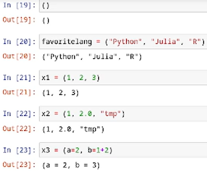{#fig-001 width=70%}

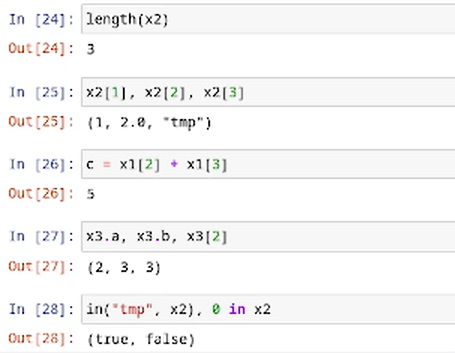{#fig-002 width=70%}

Выполним примеры из раздела словари.

Словарь -- неупорядоченный набор связанных между собой по ключу данных.

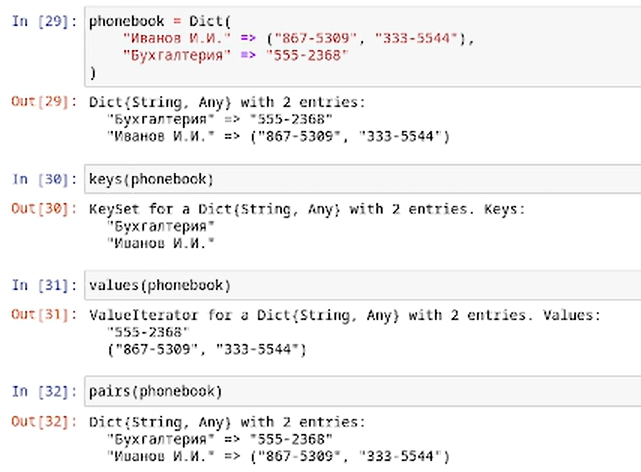{#fig-003 width=70%}

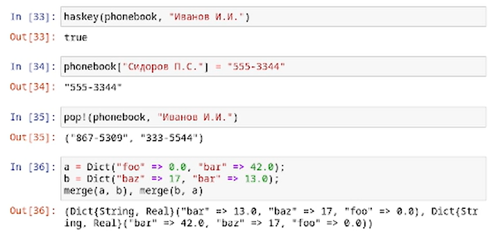{#fig-004 width=70%}

Выполним примеры из раздела множества.

Множество, как структура данных в Julia, соответствует множеству, как математическому объекту, то есть является неупорядоченной совокупностью элементов какого-либо типа. Возможные операции над множествами: объединение, пересечение, разность; принадлежность элемента множеству.

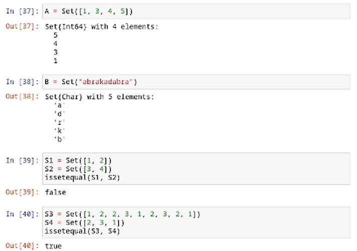{#fig-005 width=70%}

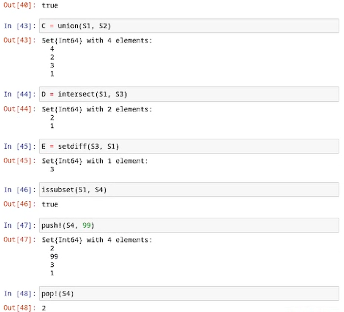{#fig-006 width=70%}

Выполним примеры из раздела массивы.

Массив -- коллекция упорядоченных элементов, размещённая в многомерной сетке. Векторы и матрицы являются частными случаями массивов.

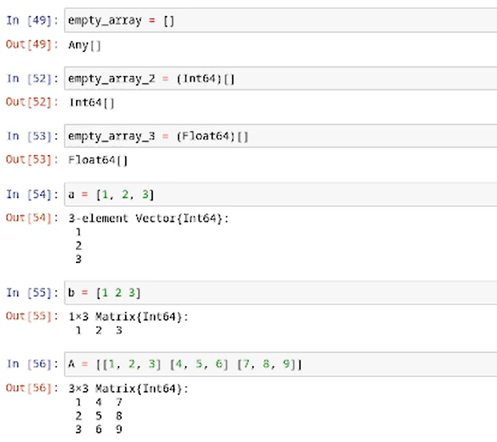{#fig-007 width=70%}

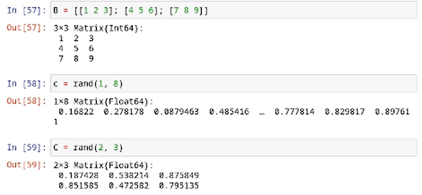{#fig-008 width=70%}

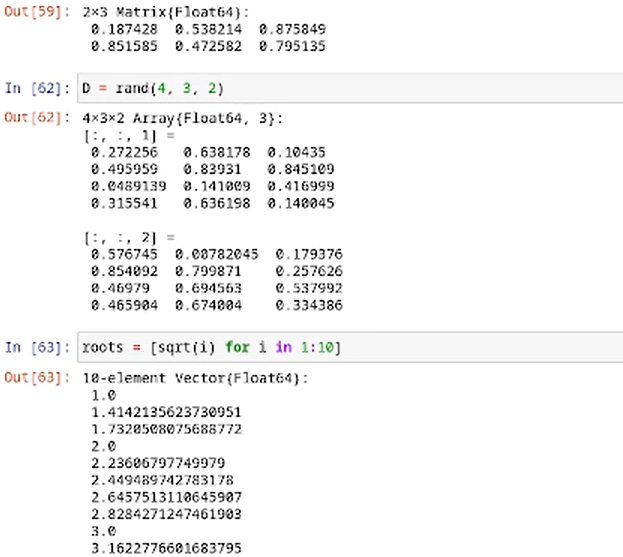{#fig-009 width=70%}

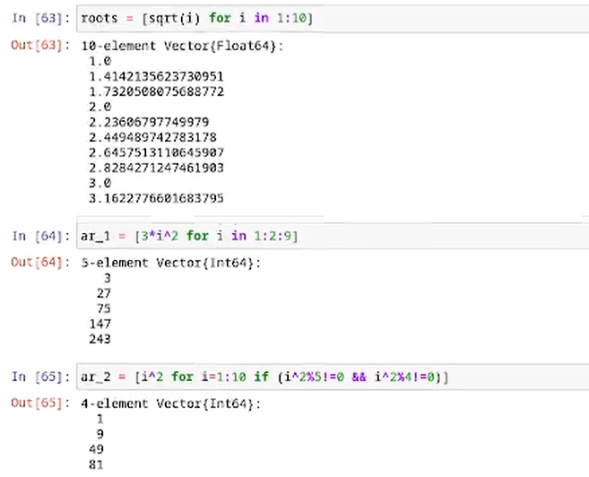{#fig-010 width=70%}

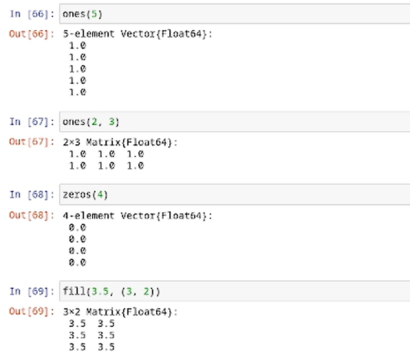{#fig-011 width=70%}

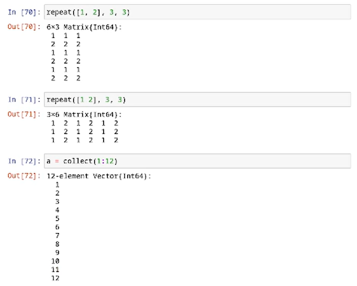{#fig-012 width=70%}

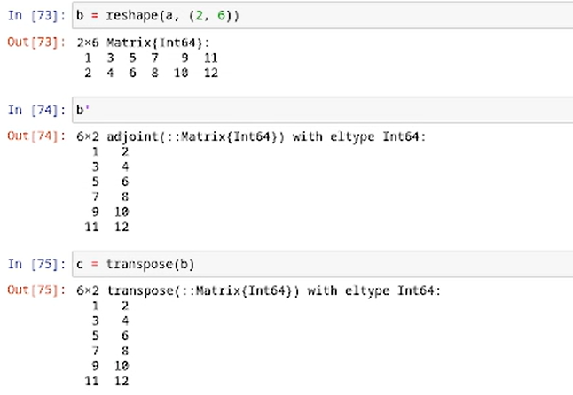{#fig-013 width=70%}

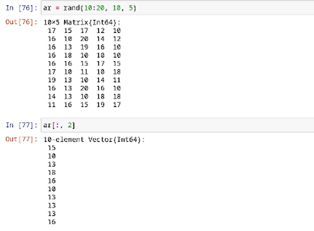{#fig-014 width=70%}

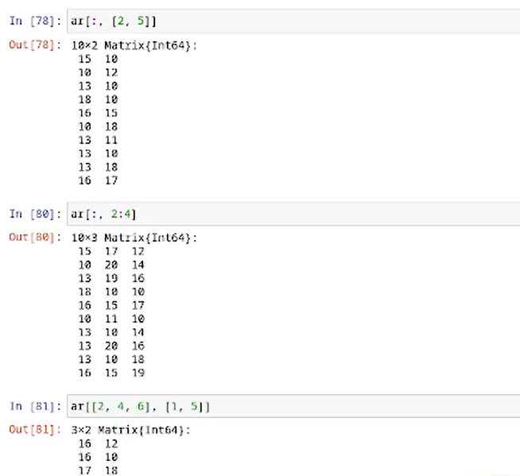{#fig-015 width=70%}

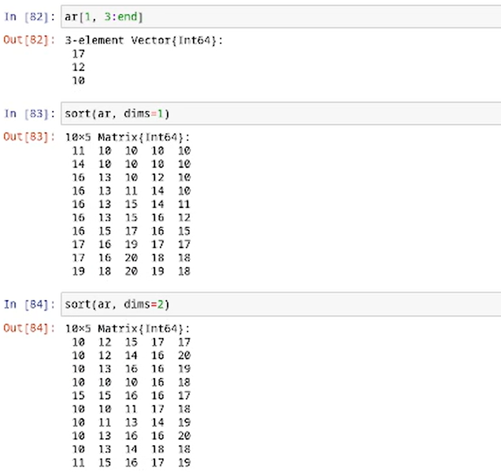{#fig-016 width=70%}

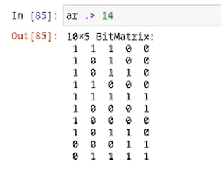{#fig-017 width=70%}

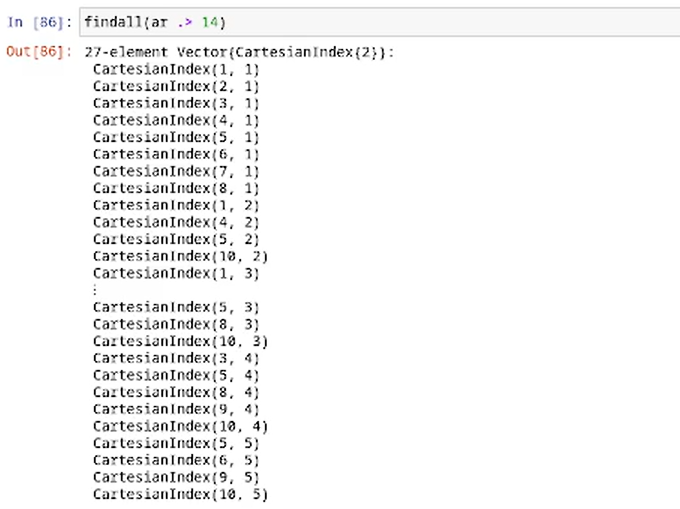{#fig-018 width=70%}

## Задания для самостоятельной работы

*Задание 1.* Работа со множествами.

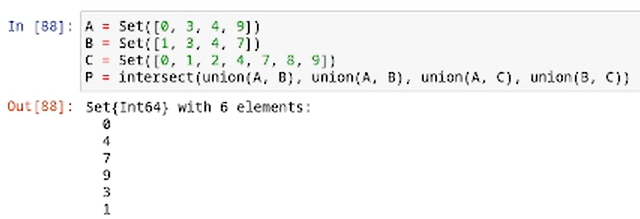{#fig-019 width=70%}

*Задание 2.* Операции над множествами элементов разных типов.

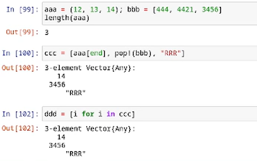{#fig-020 width=70%}

*Задание 3.* Создание разными способами массивов и векторов.

Задание 3.1.

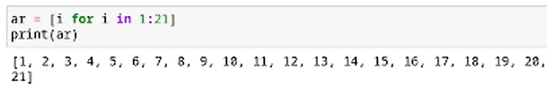{#fig-021 width=70%}

Задание 3.2.

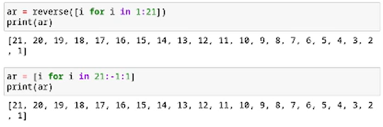{#fig-022 width=70%}

Задание 3.3.

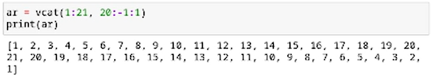{#fig-023 width=70%}

Задание 3.4.

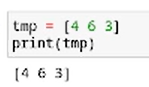{#fig-024 width=70%}

Задание 3.5.

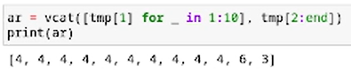{#fig-025 width=70%}

Задание 3.6.

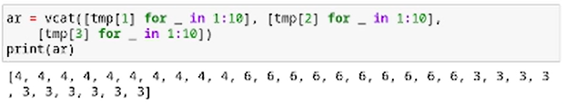{#fig-026 width=70%}

Задание 3.7.

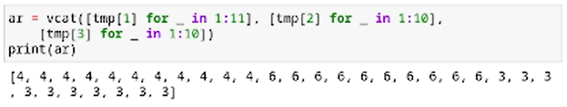{#fig-027 width=70%}

Задание 3.8.

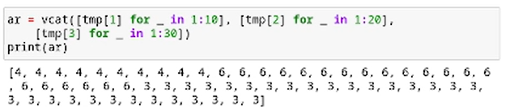{#fig-028 width=70%}

Задание 3.9.

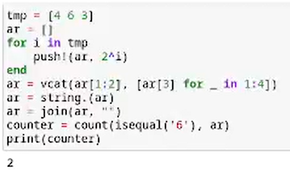{#fig-029 width=70%}

Задание 3.10.

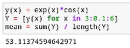{#fig-030 width=70%}

Задание 3.11.

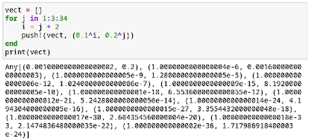{#fig-031 width=70%}

Задание 3.12.

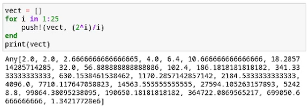{#fig-032 width=70%}

Задание 3.13.

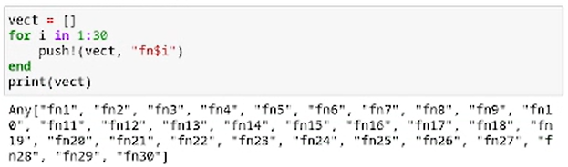{#fig-033 width=70%}

Задание 3.14.
 
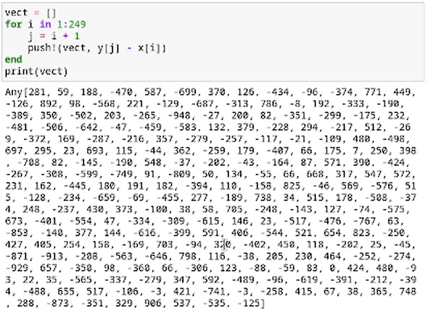{#fig-034 width=70%}

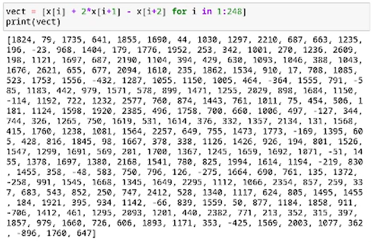{#fig-035 width=70%}

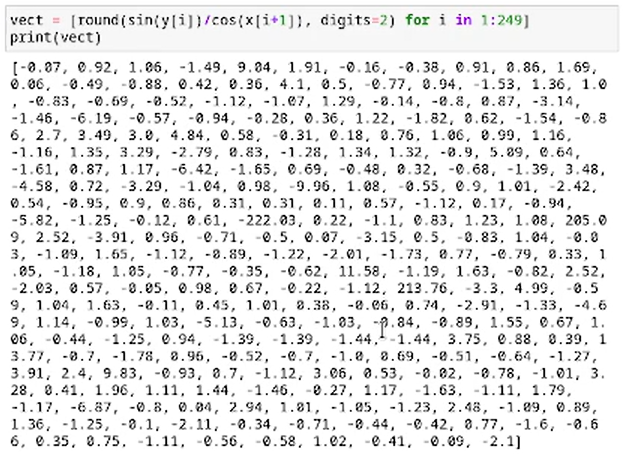{#fig-036 width=70%}

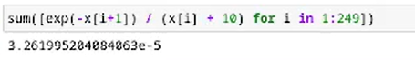{#fig-037 width=70%}

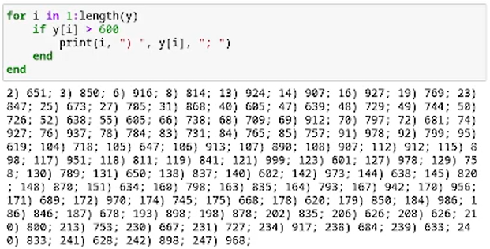{#fig-038 width=70%}

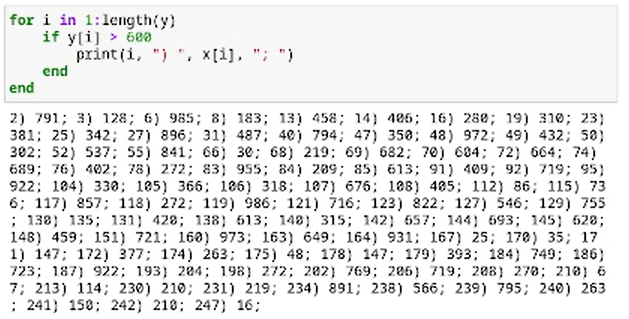{#fig-039 width=70%}

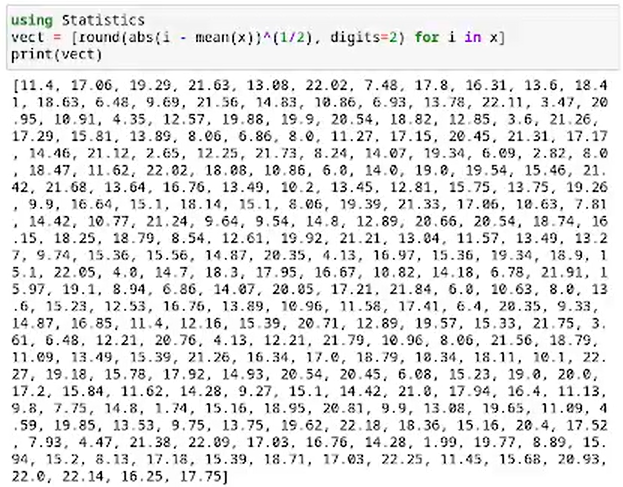{#fig-040 width=70%}

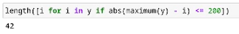{#fig-041 width=70%}

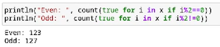{#fig-042 width=70%}

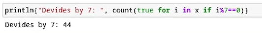{#fig-043 width=70%}

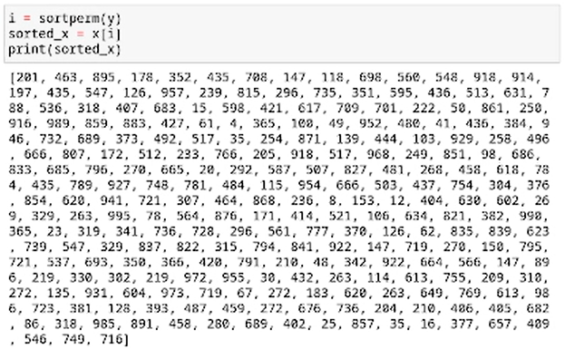{#fig-044 width=70%}

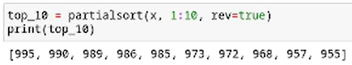{#fig-045 width=70%}

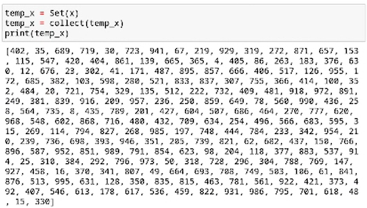{#fig-046 width=70%}

*Задание 4.* Квадраты целых чисел от 1 до 100.

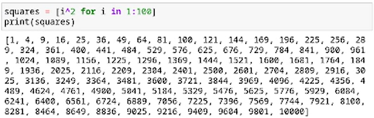{#fig-047 width=70%}

*Задание 5.* Операции с простыми числами.

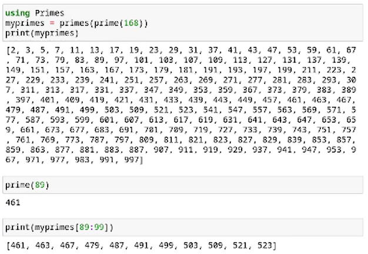{#fig-048 width=70%}

*Задание 6.* Вычисления.

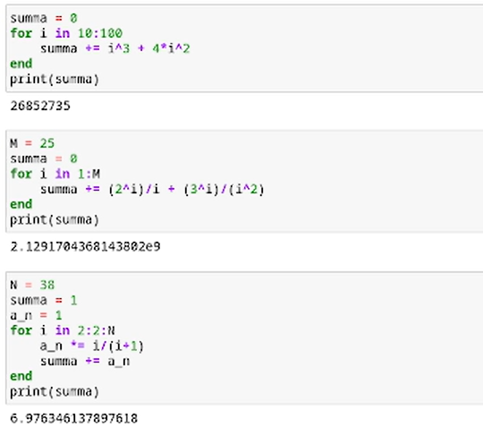{#fig-049 width=70%}

# Выводы

Изучены несколько структур данных, реализованных в Julia, их применение и операции над ними для решения задач.

# Список литературы{.unnumbered}

::: {#refs}
:::
