---
## Author
author:
  name: Александр Эдуардович Аскеров
  affiliation:
    - name: Российский университет дружбы народов
      country: Российская Федерация
      postal-code: 117198
      city: Москва
      address: ул. Миклухо-Маклая, д. 6

## Title
title: "Лабораторная работа №3"
subtitle: "Управляющие структуры"
license: "CC BY"
---

# Цель работы

Основная цель работы -- освоить применение циклов, функций и сторонних для Julia пакетов для решения задач линейной алгебры и работы с матрицами.

# Задание

1. Используя Jupyter Lab, повторите примеры из раздела 3.2.

2. Выполните задания для самостоятельной работы (раздел 3.4).

# Выполнение лабораторной работы

## Повтор примеров

Выполним примеры из раздела циклы while и for [@julia_docs_1.5].

Для различных операций, связанных с перебором индексируемых элементов структур данных, традиционно используются циклы while и for.

Например, while можно использовать для формирования элементов массива:

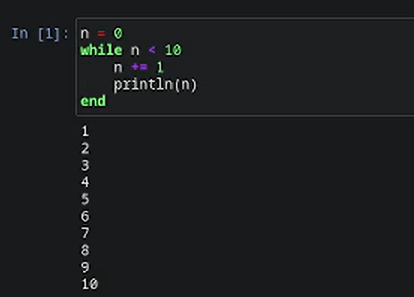{#fig-001 width=70%}

Другой пример демонстрирует использование while при работе со строковыми элементами массива, подставляя имя из массива в заданную строку приветствия и выводя получившуюся конструкцию на экран:

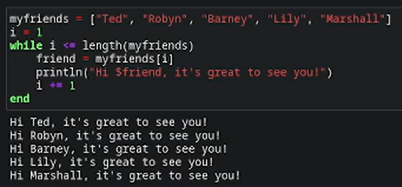{#fig-002 width=70%}

Такие же результаты можно получить при использовании цикла for.

Рассмотренные выше примеры, но с использованием цикла for:

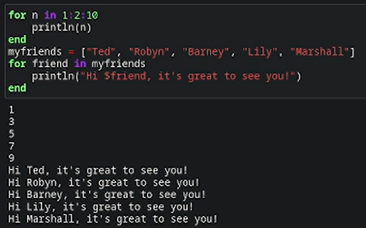{#fig-003 width=70%}

Пример использования цикла for для создания двумерного массива, в котором значение каждой записи является суммой индексов строки и столбца:

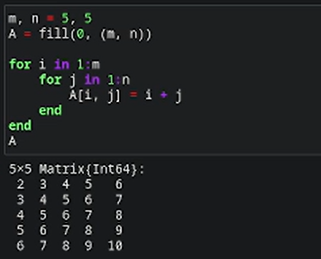{#fig-004 width=70%}

Другая реализация этого же примера:

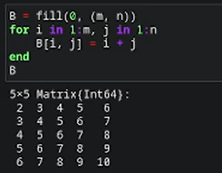{#fig-005 width=70%}

Ещё одна реализация этого же примера:

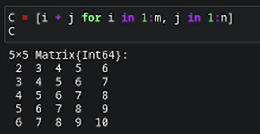{#fig-006 width=70%}

Выполним примеры из раздела условные выражения.

Довольно часто при решении задач требуется проверить выполнение тех или иных условий. Для этого используют условные выражения.

Например, пусть для заданного числа $N$ требуется вывести слово «Fizz», если $N$ делится на 3, «Buzz», если $N$ делится на 5, и «FizzBuzz», если $N$ делится на 3 и 5:

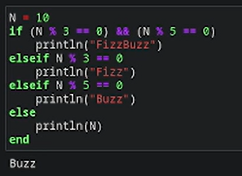{#fig-007 width=70%}

Пример использования тернарного оператора:

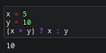{#fig-008 width=70%}

Выполним примеры из раздела функции.

Julia дает нам несколько разных способов написать функцию. Первый требует ключевых слов function и end:

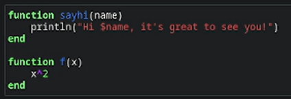{#fig-009 width=70%}

Вызов функции осуществляется по её имени с указанием аргументов, например:

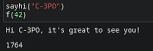{#fig-010 width=70%}

В качестве альтернативы, можно объявить любую из выше определённых функций в одной строке:

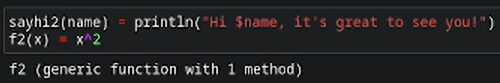{#fig-011 width=70%}

Наконец, можно объявить выше определённые функции как «анонимные»:

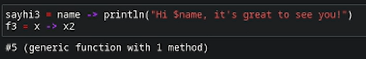{#fig-012 width=70%}

По соглашению в Julia функции, сопровождаемые восклицательным знаком, изменяют свое содержимое, а функции без восклицательного знака не делают этого.

Например, сравните результат применения sort и sort!:

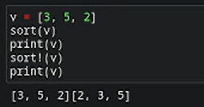{#fig-013 width=70%}

Функция sort(v) возвращает отсортированный массив, который содержит те же элементы, что и массив v, но исходный массив v остаётся без изменений. Если же использовать sort!(v), то отсортировано будет содержимое исходного массива v.

В программировании под функцией высшего порядка понимается функция, принимающая в качестве аргументов другие функции или возвращающая другую функцию в качестве результата. Основная идея состоит в том, что функции имеют тот же статус, что и другие объекты данных.

В Julia функция map является функцией высшего порядка, которая принимает функцию в качестве одного из своих входных аргументов и применяет эту функцию к каждому элементу структуры данных, которая ей передаётся также в качестве аргумента.

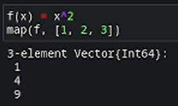{#fig-014 width=70%}

То есть в квадрат возведены все элементы массива [1, 2, 3], но не сам массив (вектор).

В map можно передать и анонимно заданную, а не именованную функцию:

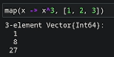{#fig-015 width=70%}

Функция broadcast – ещё одна функция высшего порядка в Julia, представляющая собой обобщение функции map. Функция broadcast() будет пытаться привести все объекты к общему измерению, map() будет напрямую применять данную функцию поэлементно.

Синтаксис для вызова broadcast такой же, как и для вызова map, например применение функции f к элементам массива [1, 2, 3]:

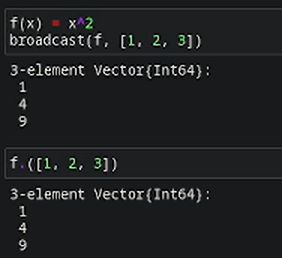{#fig-016 width=70%}

Пример:

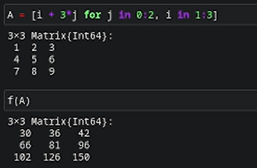{#fig-017 width=70%}

С другой стороны,

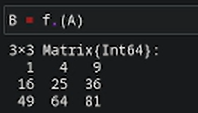{#fig-018 width=70%}

Точечный синтаксис для broadcast() позволяет записать относительно сложные составные поэлементные выражения в форме, близкой к математической записи.

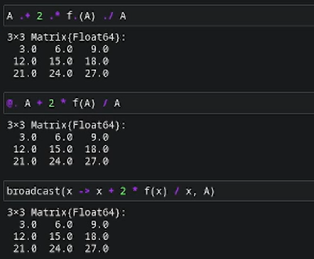{#fig-019 width=70%}

Выполним примеры из раздела сторонние библиотеки (пакеты) в Julia.

При первом использовании пакета в вашей текущей установке Julia вам необходимо использовать менеджер пакетов, чтобы явно его добавить.

При каждом новом использовании Julia (например, в начале нового сеанса в REPL или открытии блокнота в первый раз) нужно загрузить пакет, используя ключевое слово using.

Например, добавим и загрузим пакет Colors:

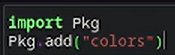{#fig-020 width=70%}

Затем создадим палитру из 100 разных цветов:

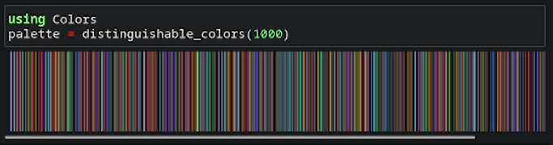{#fig-021 width=70%}

А затем определим матрицу $3 \times 3$ с элементами в форме случайного цвета из палитры, используя функцию rand:

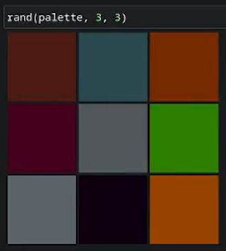{#fig-022 width=70%}

## Задания для самостоятельной работы

1. Используя циклы while и for:

1.1. Выведите на экран целые числа от 1 до 100 и напечатайте их квадраты.

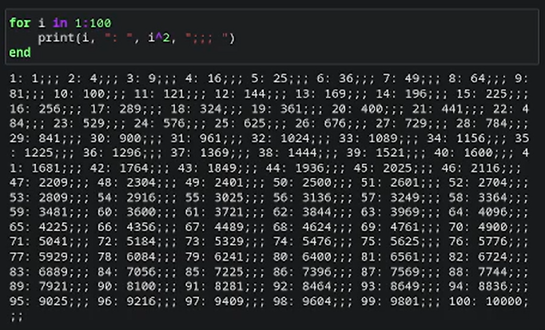{#fig-023 width=70%}

1.2. Создайте словарь squares, который будет содержать целые числа в качестве ключей и квадраты в качестве их пар-значений.

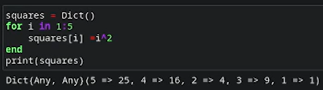{#fig-024 width=70%}

1.3. Создайте массив squares_arr, содержащий квадраты всех чисел от 1 до 100.

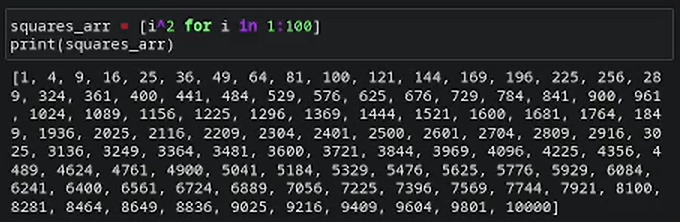{#fig-025 width=70%}

2. Напишите условный оператор, который печатает число, если число чётное, и строку «нечётное», если число нечётное. Перепишите код, используя тернарный оператор.

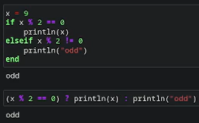{#fig-026 width=70%}

3. Напишите функцию add_one, которая добавляет 1 к своему входу.

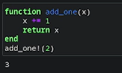{#fig-027 width=70%}

4. Используйте map() или broadcast() для задания матрицы $A$, каждый элемент которой увеличивается на единицу по сравнению с предыдущим.

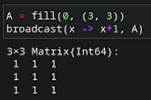{#fig-028 width=70%}

5. Задайте матрицу $A$:

5.1. Найдите $A^3$.

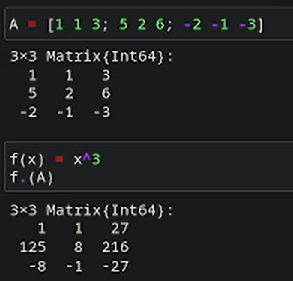{#fig-029 width=70%}

5.2. Замените третий столбец матрицы $A$ на сумму второго и третьего столбцов.

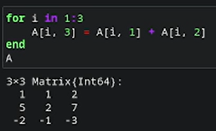{#fig-030 width=70%}

6. Создание матрицы $B$. Вычисление матрицы $C$.

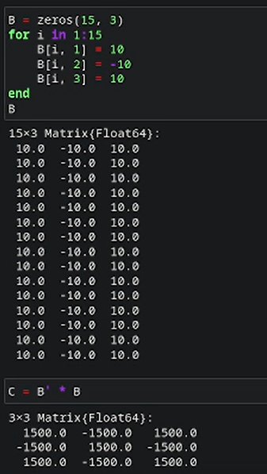{#fig-031 width=70%}

7. Создание матриц $Z_1$, $Z_2$, $Z_3$, $Z_4$.

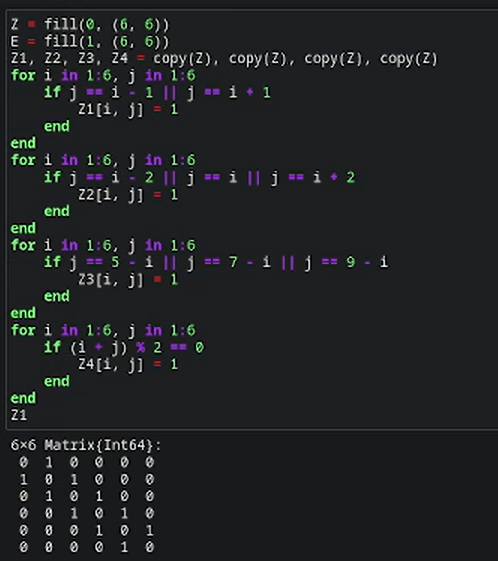{#fig-032 width=70%}

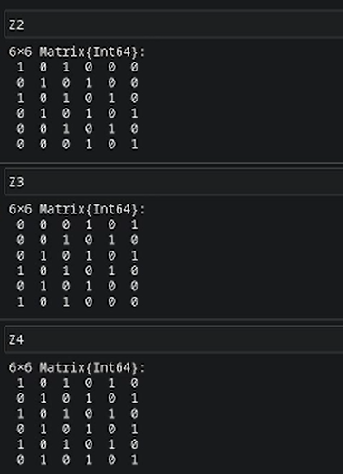{#fig-033 width=70%}

8. В языке R есть функция outer(). Фактически, это матричное умножение с возможностью изменить применяемую операцию (например, заменить произведение на сложение или возведение в степень).

8.1. Напишите свою функцию, аналогичную функции outer() языка R.

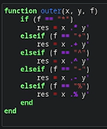{#fig-034 width=70%}

8.2. Используя написанную вами функцию outer(), создайте матрицы $A_1$, $A_2$, $A_3$, $A_4$, $A_5$.

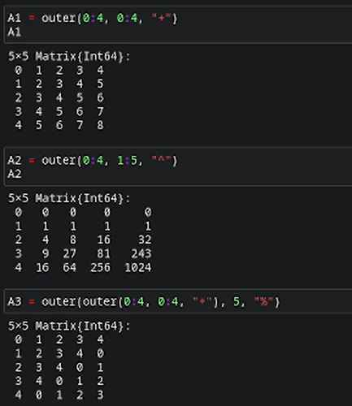{#fig-035 width=70%}

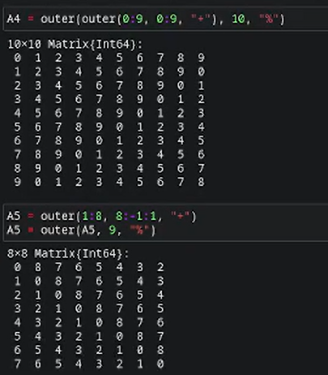{#fig-036 width=70%}

9. Решите систему линейных уравнений с 5 неизвестными.

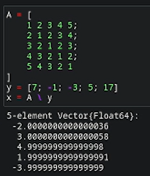{#fig-037 width=70%}

10. Создайте матрицу $M$ размерности $6 \times 10$, элементами которой являются целые числа, выбранные случайным образом с повторениями из совокупности $1, 2, \dots , 10$.

10.1. Найдите число элементов в каждой строке матрицы $M$, которые больше числа $N$ (например, $N = 4$).

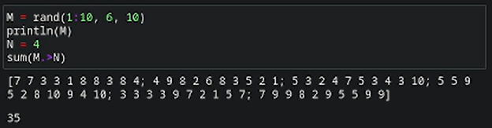{#fig-038 width=70%}

10.2. Определите, в каких строках матрицы $M$ число $M$ (например, $M = 7$) встречается ровно 2 раза?

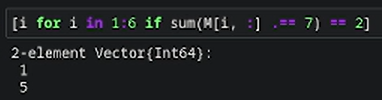{#fig-039 width=70%}

10.3. Определите все пары столбцов матрицы $M$, сумма элементов которых больше $K$ (например, $K = 75$).

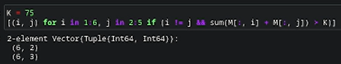{#fig-040 width=70%}

11. Вычислите суммы.

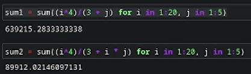{#fig-041 width=70%}

# Выводы

Освоено применение циклов, функций и сторонних для Julia пакетов для решения задач линейной алгебры и работы с матрицами.

# Список литературы{.unnumbered}

::: {#refs}
:::
