---
## Author
author:
  name: Александр Эдуардович Аскеров
  affiliation:
    - name: Российский университет дружбы народов
      country: Российская Федерация
      postal-code: 117198
      city: Москва
      address: ул. Миклухо-Маклая, д. 6

## Title
title: "Лабораторная работа №4"
subtitle: "Линейная алгебра"
license: "CC BY"
---

# Цель работы

Основной целью работы является изучение возможностей специализированных пакетов Julia для выполнения и оценки эффективности операций над объектами линейной алгебры.

# Задание

1. Используя Jupyter Lab, повторите примеры из раздела 4.2.
2. Выполните задания для самостоятельной работы.

# Выполнение лабораторной работы

## Повтор примеров

Повторим примеры из раздела поэлементные операции над многомерными массивами. [@julia_docs_1.5]

Для матрицы $4 \times 3$ рассмотрим поэлементные операции сложения и произведения её элементов:

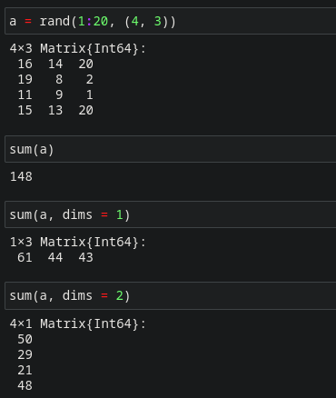{#fig-001 width=70%}

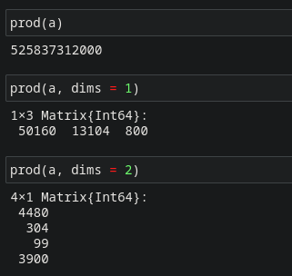{#fig-002 width=70%}

Для работы со средними значениями можно воспользоваться возможностями пакета Statistics:

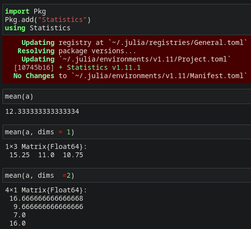{#fig-003 width=70%}

Повторим примеры из раздела транспонирование, след, ранг, определитель и инверсия матрицы.

Для выполнения таких операций над матрицами, как транспонирование, диагонализация, определение следа, ранга, определителя матрицы и т.п. можно воспользоваться библиотекой (пакетом) LinearAlgebra:

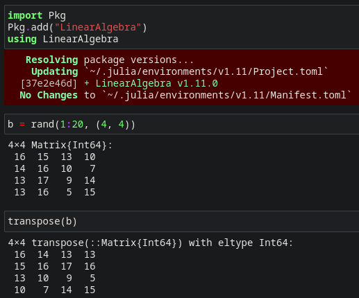{#fig-004 width=70%}

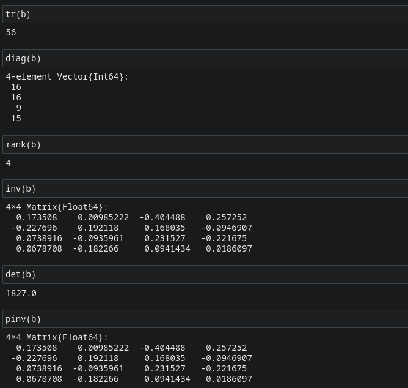{#fig-005 width=70%}

Повторим примеры из раздела вычисление нормы векторов и матриц, повороты, вращения.

Для вычисления нормы используется LinearAlgebra.norm(x).

Евклидова норма:

$$
\| \vec{X} \|_2 = \sqrt{x_1^2 + x_2^2 + \dots + x_n^2}
$$

p-норма:

$$
\| \vec{A} \|_p = \left( \sum_{i=1}^n |a_i|^p \right)^{1/p}
$$

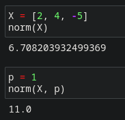{#fig-006 width=70%}

Евклидово расстояние между двумя векторами $\vec{X}$ и $\vec{Y}$ определяется как $\| \vec{X} - \vec{Y} \|_2$.

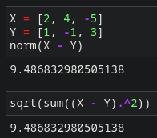{#fig-007 width=70%}

Угол между двумя векторами⃗ $\vec{X}$ и $\vec{Y}$ определяется как $\cos^{-1}\left( \frac{\vec{X}^T \vec{Y}}{\| \vec{X} \|_2 \| \vec{Y} \|_2} \right)$.

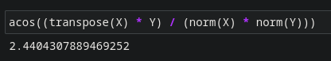{#fig-008 width=70%}

Вычисление нормы для двумерной матрицы:

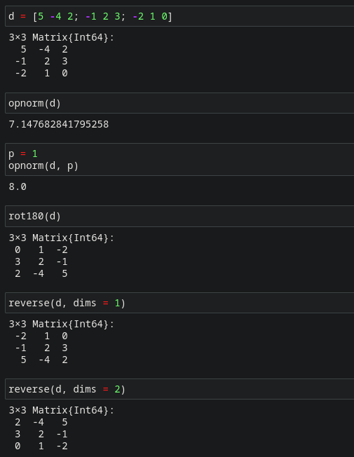{#fig-009 width=70%}

Повторим примеры из раздела матричное умножение, единичная матрица, скалярное произведение.

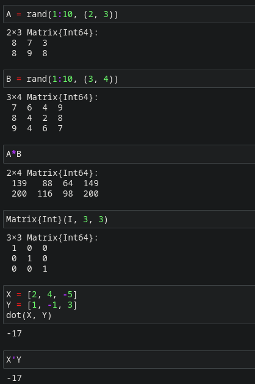{#fig-010 width=70%}

Повторим примеры из раздела факторизация, специальные матричные структуры.
Решение систем линейный алгебраических уравнений $Ax = b$:

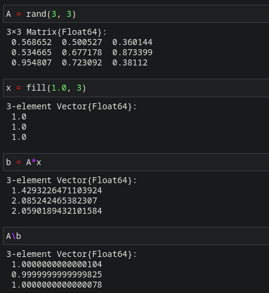{#fig-011 width=70%}

Julia позволяет вычислять LU-факторизацию и определяет составной тип факторизации для его хранения:

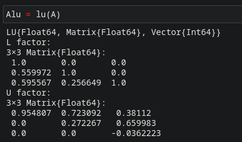{#fig-012 width=70%}

Различные части факторизации могут быть извлечены путём доступа к их специальным свойствам:

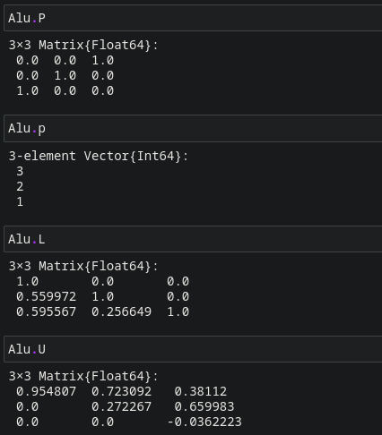{#fig-013 width=70%}

Исходная система уравнений $Ax = b$ может быть решена или с использованием
исходной матрицы, или с использованием объекта факторизации:

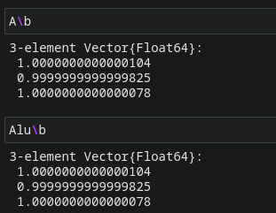{#fig-014 width=70%}

Аналогично можно найти детерминант матрицы:

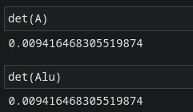{#fig-015 width=70%}

Julia позволяет вычислять QR-факторизацию и определяет составной тип факторизации для его хранения:

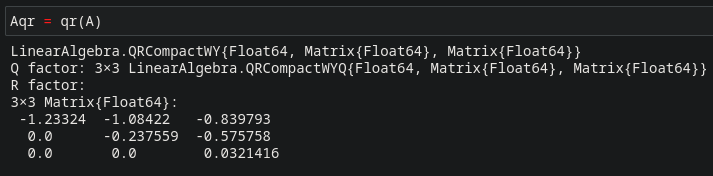{#fig-016 width=70%}

По аналогии с LU-факторизацией различные части QR-факторизации могут быть извлечены путём доступа к их специальным свойствам:

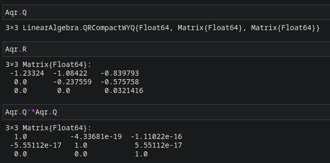{#fig-017 width=70%}

Примеры собственной декомпозиции матрицы $A$:

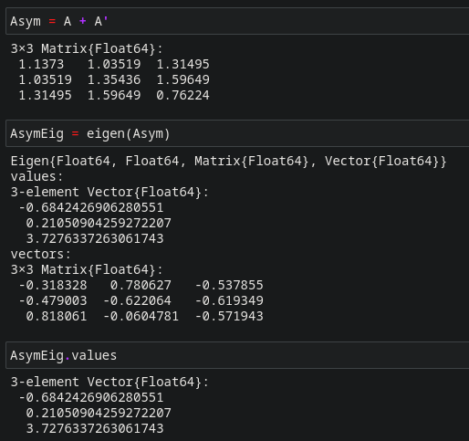{#fig-018 width=70%}

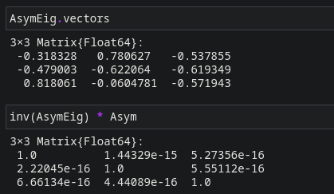{#fig-019 width=70%}

Далее рассмотрим примеры работы с матрицами большой размерности и специальной структуры.

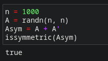{#fig-020 width=70%}

Пример добавления шума в симметричную матрицу (матрица уже не будет симмет-
ричной):

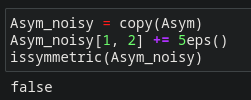{#fig-021 width=70%}

В Julia можно объявить структуру матрицы явно, например, используя Diagonal,Triangular, Symmetric, Hermitian, Tridiagonal и SymTridiagonal:

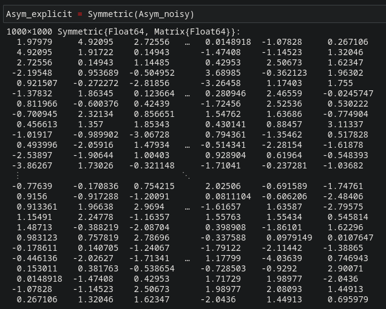{#fig-022 width=70%}

Далее для оценки эффективности выполнения операций над матрицами большой
размерности и специальной структуры воспользуемся пакетом BenchmarkTools:

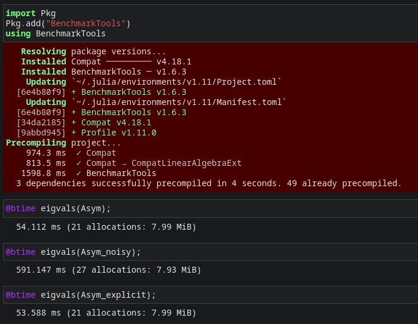{#fig-023 width=70%}

Далее рассмотрим примеры работы с разряженными матрицами большой размерности.

Использование типов Tridiagonal и SymTridiagonal для хранения трёхдиагональных матриц позволяет работать с потенциально очень большими трёхдиагональными матрицами:

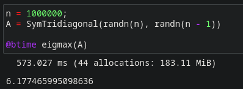{#fig-024 width=70%}

При попытке задать подобную матрицу обычным способом и посчитать её собственные значения, вы скорее всего получите ошибку переполнения памяти:

{#fig-025 width=70%}

Повторим примеры из раздела общая линейная алгебра.

Julia также поддерживает общую линейную алгебру, что позволяет, например, работать с матрицами и векторами рациональных чисел.

Для задания рационального числа используется двойная косая черта:

{#fig-026 width=30%}

В следующем примере показано, как можно решить систему линейных уравнений с рациональными элементами без преобразования в типы элементов с плавающей запятой (для избежания проблемы с переполнением используем BigInt):

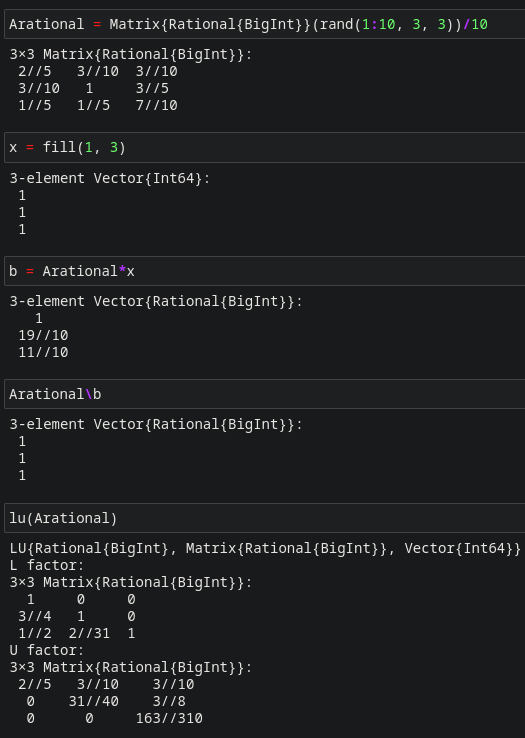{#fig-027 width=70%}

## Выполнение заданий для самостоятельной работы

### Произведение векторов

1. Задайте вектор v. Умножьте вектор v скалярно сам на себя и сохраните результат в dot_v.

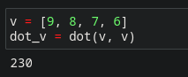{#fig-028 width=70%}

2.Умножьте v матрично на себя (внешнее произведение), присвоив результат переменной outer_v.

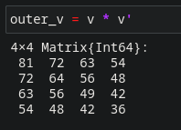{#fig-029 width=70%}

### Системы линейных уравнений

1. Решить СЛАУ с двумя неизвестными.

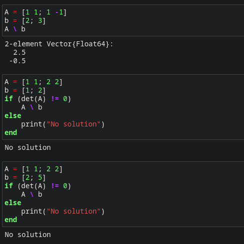{#fig-030 width=70%}

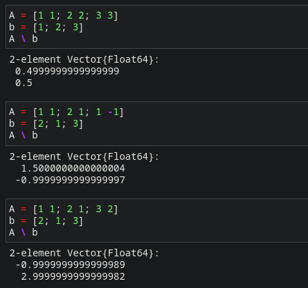{#fig-031 width=70%}

2. Решить СЛАУ с тремя неизвестными.

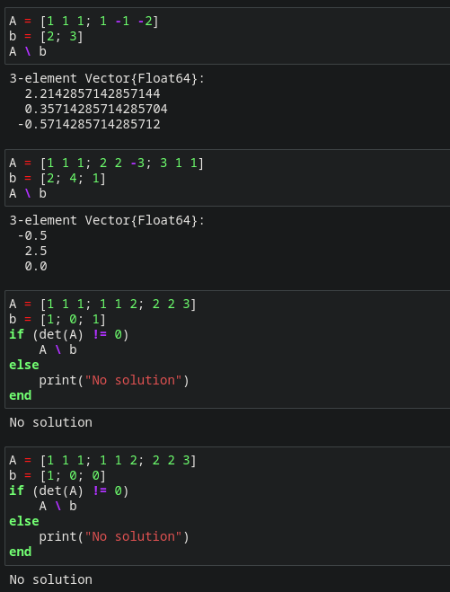{#fig-032 width=70%}

### Операции с матрицами

1. Приведите приведённые ниже матрицы к диагональному виду.

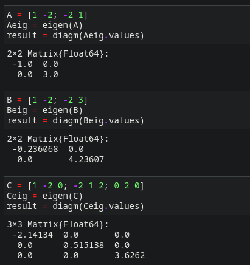{#fig-033 width=70%}

2. Вычислите.

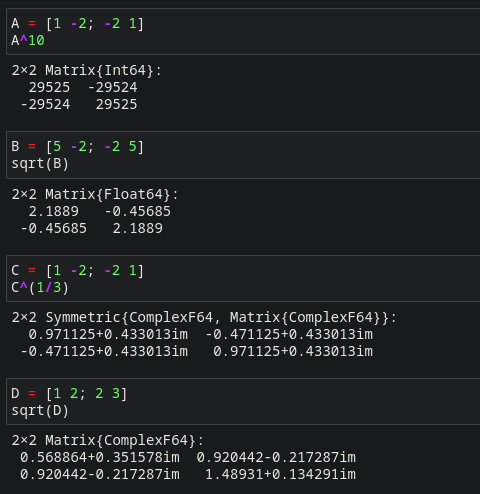{#fig-034 width=70%}

3. Найдите собственные значения матрицы $A$.

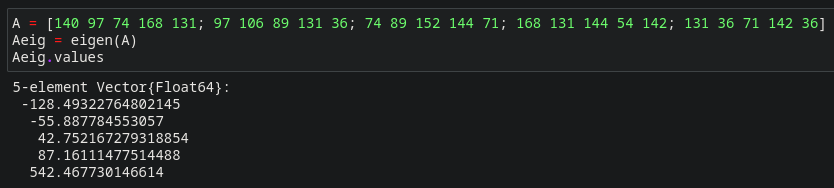{#fig-035 width=70%}

Создайте диагональную матрицу из собственных значений матрицы $A$.

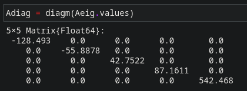{#fig-036 width=70%}

Создайте нижнедиагональную матрицу из матрицы $A$.

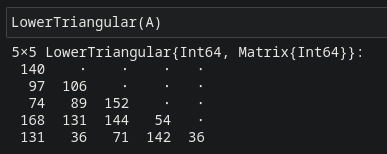{#fig-037 width=70%}

Оцените эффективность выполняемых операций.

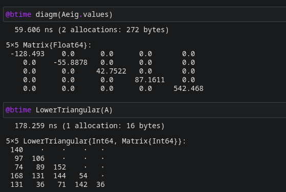{#fig-038 width=70%}

### Линейные модели экономики

Линейная модель экономики может быть записана как СЛАУ

$$
x - Ax = y,
$$

где элементы матрицы $A$ и столбца $y$ -- неотрицательные числа. По своему смыслу в экономике элементы матрицы $A$ и столбцов $x, y$ не могут быть отрицательными числами.

1. Матрица $A$ называется продуктивной, если решение $x$ системы при любой неотрицательной правой части $y$ имеет только неотрицательные элементы $x_i$. Используя это определение, проверьте, являются ли матрицы продуктивными.

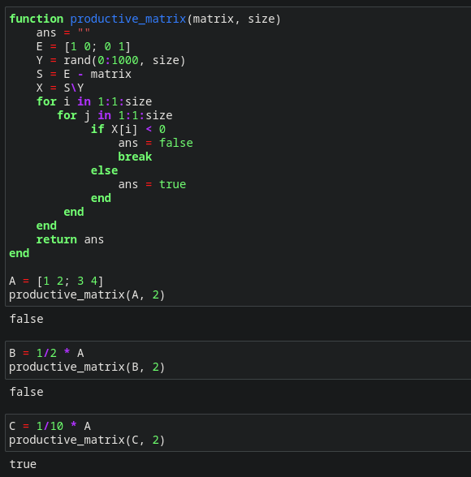{#fig-039 width=70%}

2. Критерий продуктивности: матрица $A$ является продуктивной тогда и только тогда, когда все элементы матрицы

$$
(E - A)^{-1}
$$

являются неотрицательными числами. Используя этот критерий, проверьте, являются ли матрицы продуктивными.

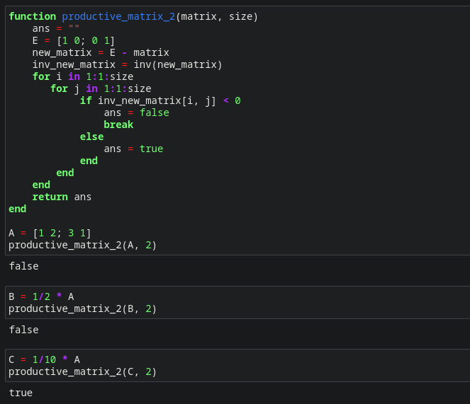{#fig-040 width=70%}

3. Спектральный критерий продуктивности: матрица $A$ является продуктивной тогда и только тогда, когда все её собственные значения по модулю меньше 1. Используя этот критерий, проверьте, являются ли матрицы продуктивными.

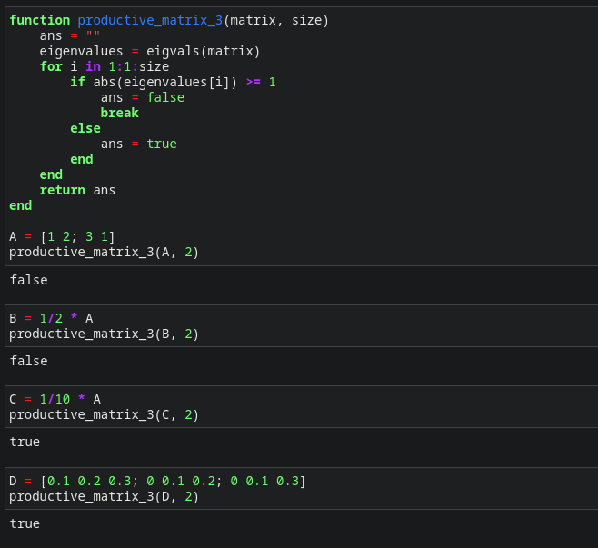{#fig-041 width=70%}

# Выводы

Изучены возможности специализированных пакетов Julia для выполнения и оценки эффективности операций над объектами линейной алгебры.

# Список литературы{.unnumbered}

::: {#refs}
:::
