---
## Author
author:
  name: Александр Эдуардович Аскеров
  affiliation:
    - name: Российский университет дружбы народов
      country: Российская Федерация
      postal-code: 117198
      city: Москва
      address: ул. Миклухо-Маклая, д. 6
## Title
title: Лабораторная работа №6
subtitle: Решение моделей в непрерывном и дискретном времени
license: CC BY
date: today
date-format: "2025-11-22"
---

# Информация

## Докладчик

:::::::::::::: {.columns align=center}
::: {.column width="70%"}

  * Аскеров Александр Эдуардович
  * Кафедра теории вероятностей и кибербезопасности
  * Российский университет дружбы народов им. П. Лумумбы

:::
::: {.column width="30%"}

:::
::::::::::::::

# Вводная часть

## Цель работы

Основной целью работы является освоение специализированных пакетов для решения задач в непрерывном и дискретном времени.

## Задание

1. Используя Jupyter Lab, повторите примеры из раздела 6.2.

2. Выполните задания для самостоятельной работы.

# Модель экспоненциального роста

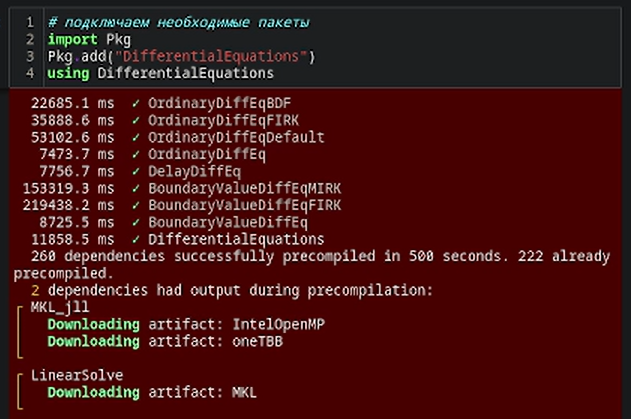{#fig-001 width=38%}

# Модель экспоненциального роста

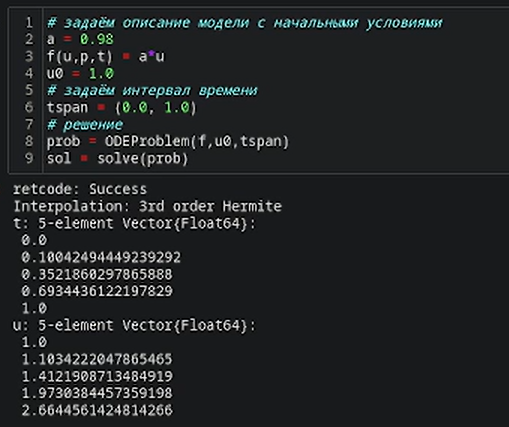{#fig-002 width=38%}

# Модель экспоненциального роста

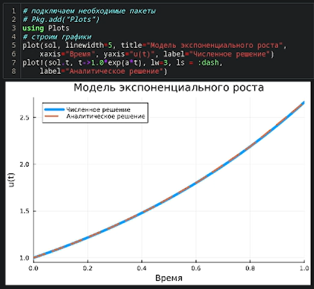{#fig-003 width=38%}

# Модель экспоненциального роста

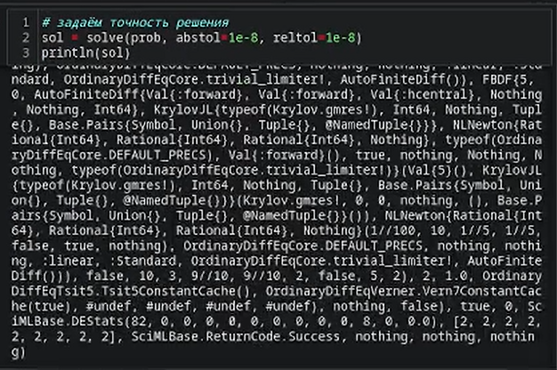{#fig-004 width=38%}

# Модель экспоненциального роста

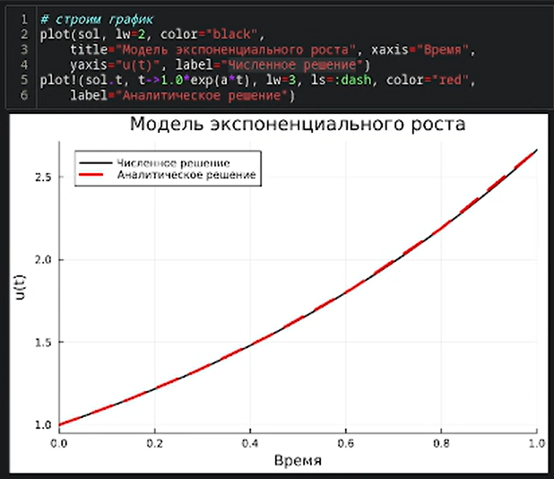{#fig-005 width=38%}

# Система Лоренца

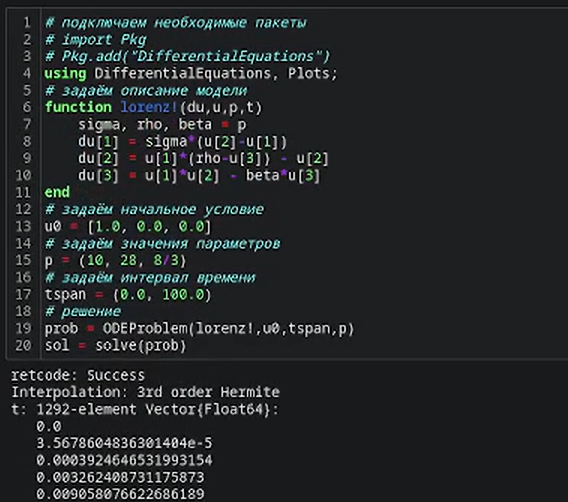{#fig-006 width=38%}

# Система Лоренца

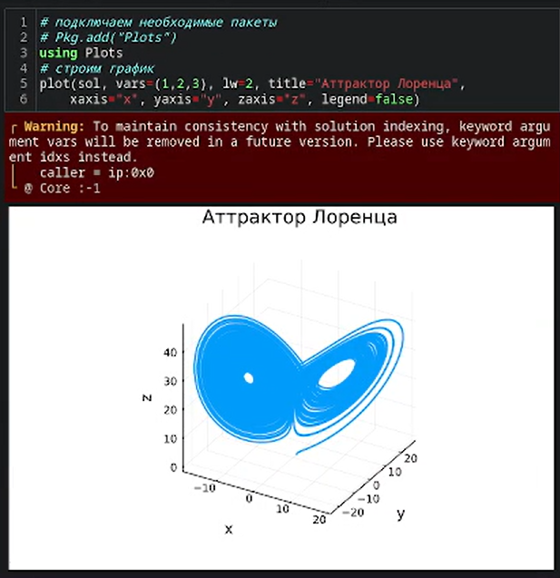{#fig-007 width=38%}

# Система Лоренца

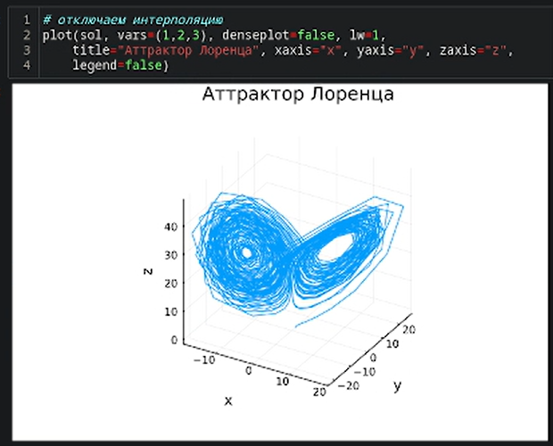{#fig-008 width=38%}

# Модель Лотки–Вольтерры

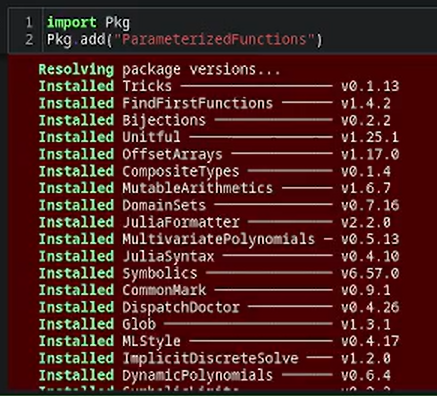{#fig-009 width=38%}

# Модель Лотки–Вольтерры

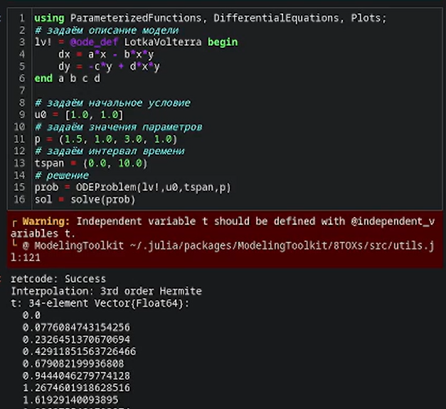{#fig-010 width=38%}

# Модель Лотки–Вольтерры

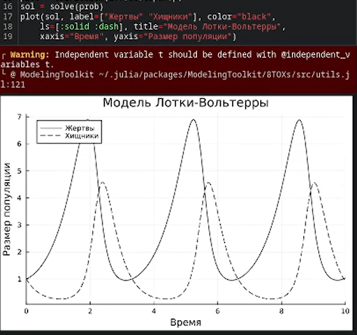{#fig-011 width=38%}

# Модель Лотки–Вольтерры

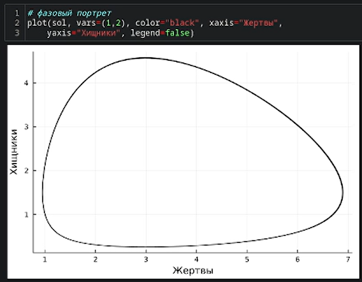{#fig-012 width=38%}

# Задания для самостоятельного выполнения

№1.

Реализуем и проанализируем модель роста численности изолированной популяции (модель Мальтуса):

$$\dot x = ax, \quad a = b – c,$$

где $x(t)$ -- численность изолированной популяции в момент времени $t$, $a$ -- коэффициент роста популяции, $b$ -- коэффициент рождаемости, $c$ -- коэффициент смертности. Построим соответствующие графики (в том числе с анимацией).

# Задания для самостоятельного выполнения

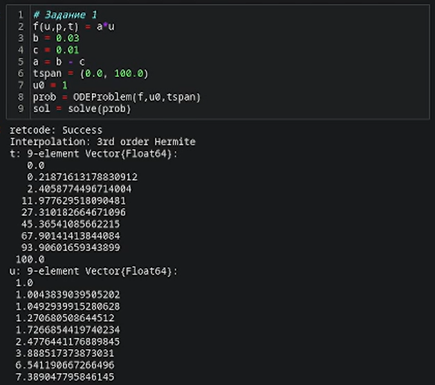{#fig-013 width=38%}

# Задания для самостоятельного выполнения

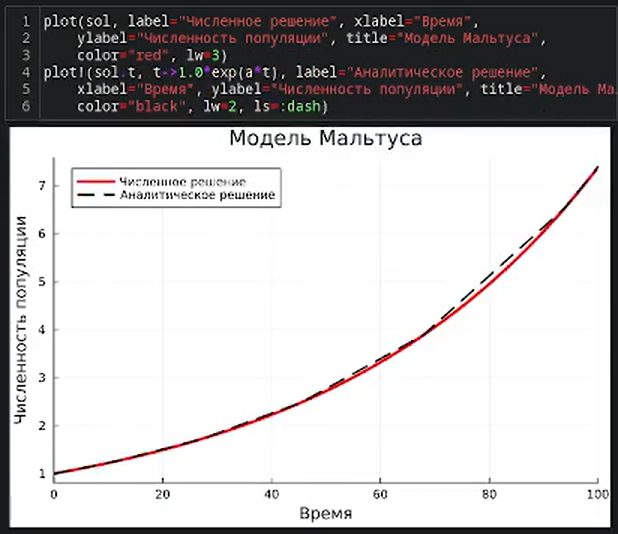{#fig-014 width=38%}

# Задания для самостоятельного выполнения

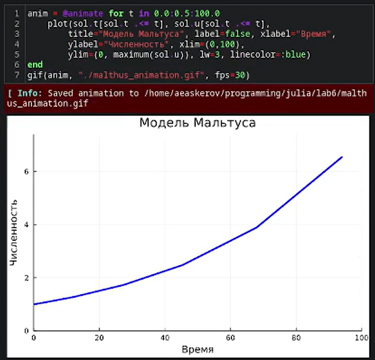{#fig-015 width=38%}

# Задания для самостоятельного выполнения

№2.

Реализуем и проанализируем логистическую модель роста популяции:

$$\dot x = rx(1 - \dfrac{x}{k}), \quad r>0, \quad k>0,$$

где $r$ -- коэффициент роста популяции, $k$ -- потенциальная ёмкость экологической системы (предельное значение численности популяции). Построим соответствующие графики (в том числе с анимацией).

# Задания для самостоятельного выполнения

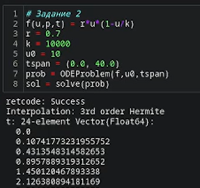{#fig-016 width=38%}

# Задания для самостоятельного выполнения

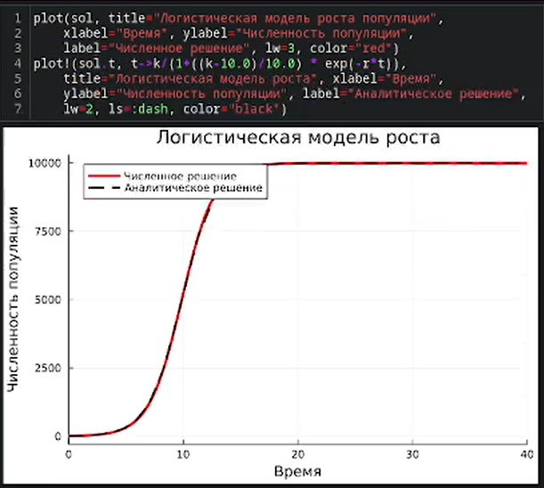{#fig-017 width=38%}

# Задания для самостоятельного выполнения

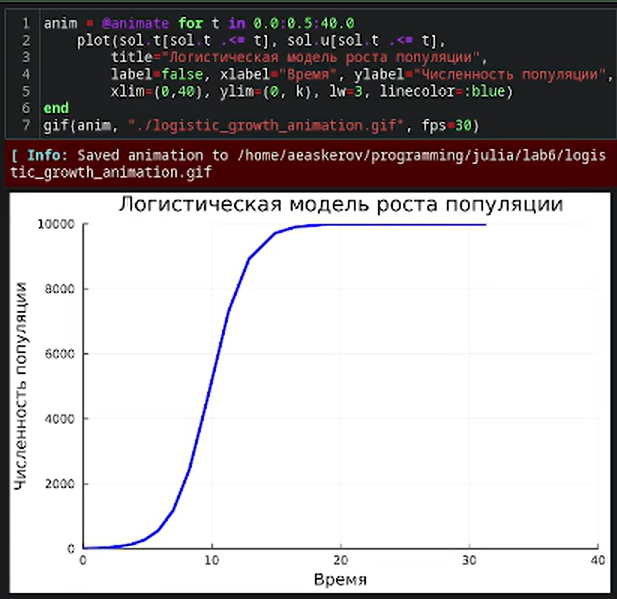{#fig-018 width=38%}

# Задания для самостоятельного выполнения

№3.

Реализуем и проанализируем логистическую модель эпидемии Кермака–Маккендрика (SIR-модель):

$$
\begin{cases}
\dot s = - \beta i s, \\
\dot i = \beta i s - \nu i, \\
\dot r = \nu i,
\end{cases}
$$

# Задания для самостоятельного выполнения

где $s(t)$ -- численность восприимчивых к болезни индивидов в момент времени t, $i(t)$ -- численность инфицированных индивидов в момент времени t, $r(t)$ -- численность переболевших индивидов в момент времени t, $N$ -- это сумма этих трёх, $\beta$ -- коэффициент интенсивности контактов индивидов с последующим инфицированием, $\nu$ -- коэффициент интенсивности выздоровления соответственно инфицированных индивидов. Численность популяции считается постоянной, т.е. $\dot s + \dot i + \dot r = 0$. Построим соответствующие графики (в том числе с анимацией).

# Задания для самостоятельного выполнения

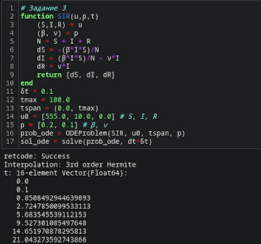{#fig-019 width=38%}

# Задания для самостоятельного выполнения

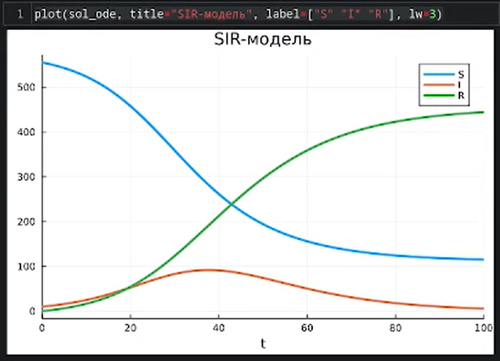{#fig-020 width=38%}

# Задания для самостоятельного выполнения

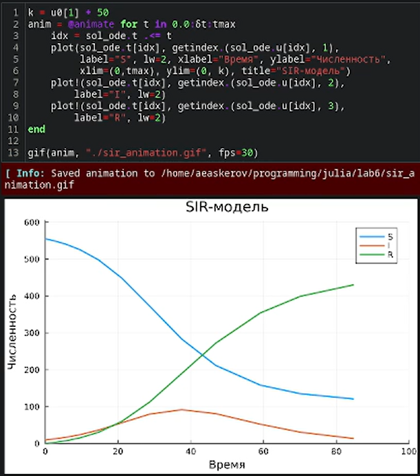{#fig-021 width=38%}

# Задания для самостоятельного выполнения

№4.

Как расширение модели SIR (Susceptible-Infected-Removed) по результатам эпидемии испанки была предложена модель SEIR (Susceptible-Exposed-Infected-Removed).

$$
\begin{cases}
\dot s(t) = - \dfrac{\beta}{N} s(t) i(t), \\
\dot e(t) = \dfrac{\beta}{N} s(t) i(t) - \delta e(t), \\
\dot i(t) = \delta e(t) - \gamma i(t), \\
\dot r(t) = \gamma i(t),
\end{cases}
$$

# Задания для самостоятельного выполнения

Размер популяции сохраняется:

$$
s(t) + e(t) + i(t) + r(t) = N
$$

Исследуем и сравним с SIR.

# Задания для самостоятельного выполнения

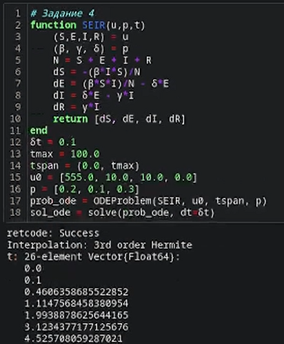{#fig-022 width=38%}

# Задания для самостоятельного выполнения

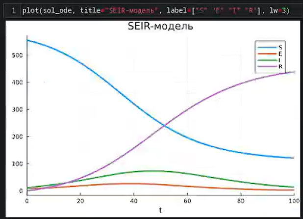{#fig-023 width=38%}

# Задания для самостоятельного выполнения

№5.

Для дискретной модели Лотки–Вольтерры:

$$
\begin{cases}
X_1(t+1) = a X_1(t)(1-X_1(t)) - X_1(t) X_2(t), \\
X_2(t+1) = -c X_2(t) - d X_1(t) X_2(t).
\end{cases}
$$

с начальными данными $a = 2, c = 1, d = 5$ найдём точку равновесия. Получим и сравним аналитическое и численное решения. Численное решение изобразим на фазовом портрете.

# Задания для самостоятельного выполнения

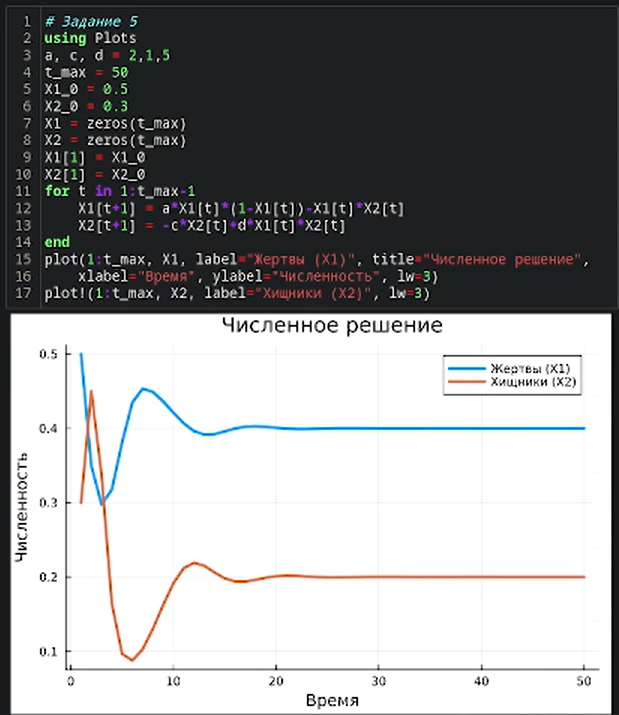{#fig-024 width=38%}

# Задания для самостоятельного выполнения

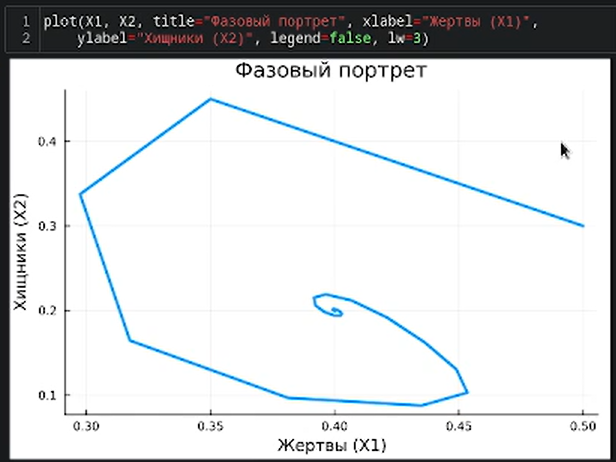{#fig-025 width=38%}

# Задания для самостоятельного выполнения

№6.

Реализуем на языке Julia модель отбора на основе конкурентных отношений:

$$
\begin{cases}
\dot x = \alpha x - \beta xy, \\
\dot y = \alpha y - \beta xy,
\end{cases}
$$

Построим соответствующие графики (в том числе с анимацией) и фазовый портрет.

# Задания для самостоятельного выполнения

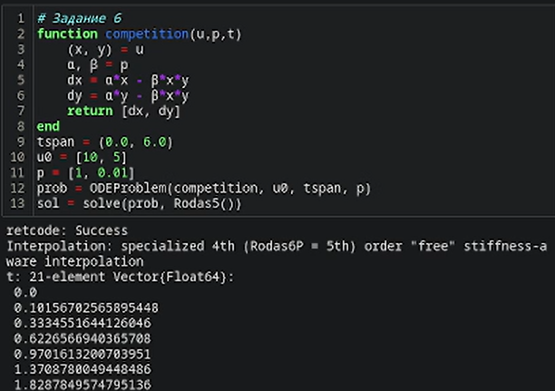{#fig-026 width=38%}

# Задания для самостоятельного выполнения

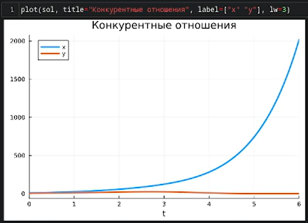{#fig-027 width=38%}

# Задания для самостоятельного выполнения

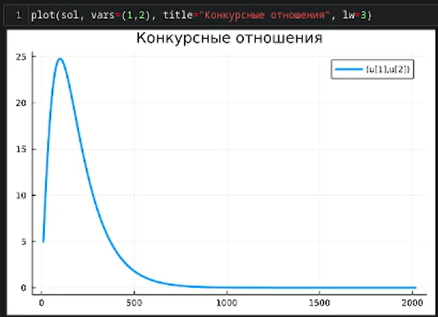{#fig-028 width=38%}

# Задания для самостоятельного выполнения

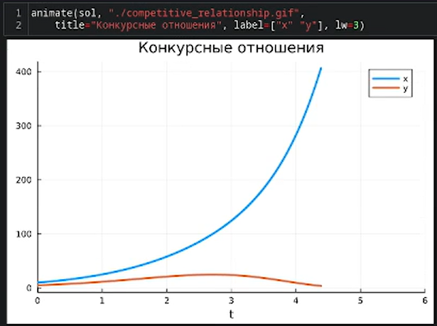{#fig-029 width=38%}

# Задания для самостоятельного выполнения

№7.

Реализуем на языке Julia модель консервативного гармонического осциллятора:

$$
\ddot x + \omega_0 ^2 = 0, x(t_0) = x_0, \dot x(t_0) = y_0,
$$

где \omega_0 -- циклическая частота. Построим соответствующие графики (в том числе с анимацией) и фазовый портрет.

# Задания для самостоятельного выполнения

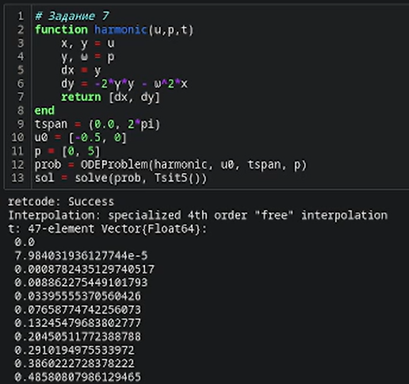{#fig-030 width=38%}

# Задания для самостоятельного выполнения

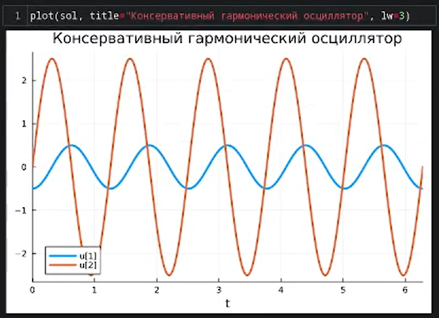{#fig-031 width=38%}

# Задания для самостоятельного выполнения

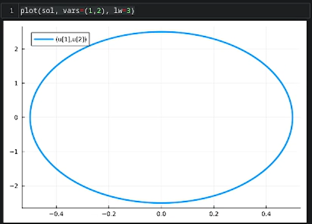{#fig-032 width=38%}

# Задания для самостоятельного выполнения

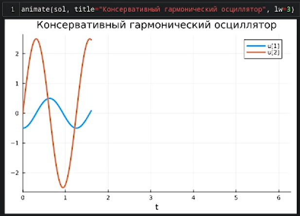{#fig-033 width=38%}

# Задания для самостоятельного выполнения

№8.

Реализуем на языке Julia модель свободных колебаний гармонического осциллятора:

$$
\ddot x + 2\gamma \dot x + \omega_0 ^2 = 0, x(t_0) = x_0, \dot x(t_0) = y_0.
$$

где \omega_0 -- циклическая частота, \gamma -- параметр, характеризующий потери энергии. Построим соответствующие графики (в том числе с анимацией) и фазовый портрет.

# Задания для самостоятельного выполнения

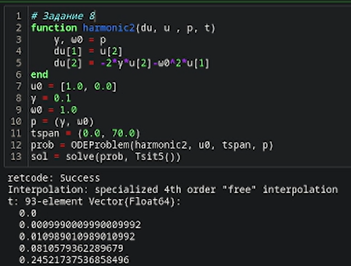{#fig-034 width=38%}

# Задания для самостоятельного выполнения

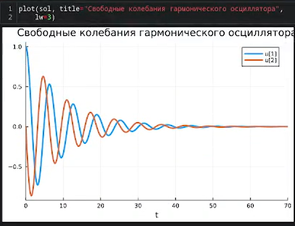{#fig-035 width=38%}

# Задания для самостоятельного выполнения

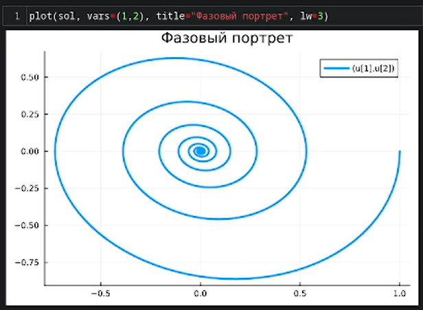{#fig-036 width=38%}

# Задания для самостоятельного выполнения

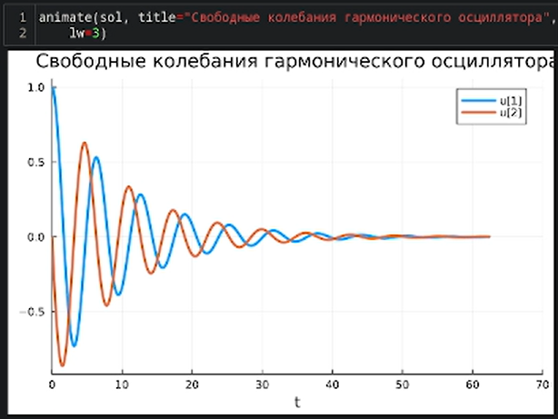{#fig-037 width=38%}

# Выводы

Освоены специализированные пакеты для решения задач в непрерывном и дискретном времени.

